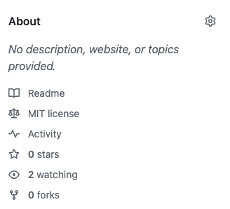
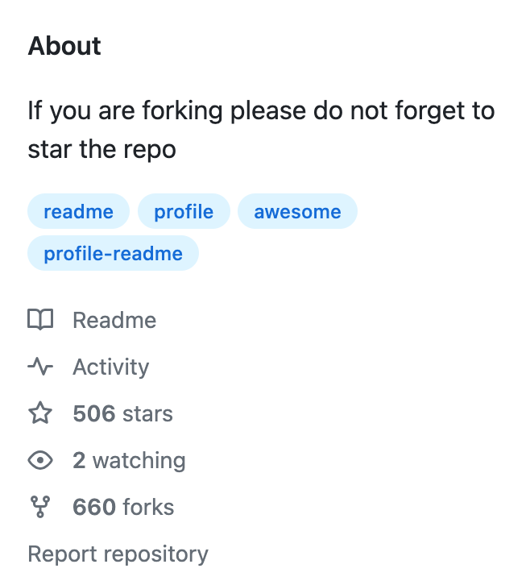

# notes

Below are my notes from [A beginner’s guide to writing a stunning GitHub profile readme.](https://medium.com/theleanprogrammer/a-beginner-guide-to-writing-a-stunning-github-profile-readme-6ee0e211f5a8) by Yadvi Bhalla.

1. Keep it simple.

   Creative.

   But clean with info. No more than 2 gifs.

2. Start with the nice-looking header image.

   Adding a header image or a gif can give your readme an awesome start. You could include your name and your current position in it. But how to create your own header. I would suggest canva.com to create a personalized banner or header for your readme. Check it out!

3. Write a short intro about yourself.

   I personally feel this is the most important part of your readme profile. Write a short paragraph or bullet points in about 8 to 10 lines describing your skills and achievements. Make sure to keep it professional.

4. Mention your tech stack and skills.

   For including tech skills, you can either use badges or icons for technologies. Mentioned below are some of the tools you can use to create badges and icons according to your tech stack.

5. Include stats and language cards.

   The next step is to include the statistics and language card. It will make your GitHub profile look more awesome and stunning.

6. Some useful resources

   Now it’s completely your choice what else you want to include to make your readme outstanding from others. I’ve mentioned a list of some useful resources below:

   (See `Some useful resources` in the [A beginner’s guide to writing a stunning GitHub profile readme.](https://medium.com/theleanprogrammer/a-beginner-guide-to-writing-a-stunning-github-profile-readme-6ee0e211f5a8) article by Yadvi Bhalla.)

## things I like

**Things I've noticed in other people's profile readme files that I want to emulate.**

I like to read on someone's profile readme that they welcome questions, people reaching out to them, etc.
Do the same on mine.

> I love connecting with different people so if you want to say hi, I'll be happy to meet you more! :)

## features to add

A `Current Projects` section.

A statement welcoming people to reach out to me, ask questions, etc.

## things to change/improve

### description

I've noticed that I don't have the description filled in. Should I have one?

See the below "about" image:

See this "If you are forking please do not forget to star the repo" fork suggestion:

### Header/banner

There isn't one.

### Color

It's all text. No emojis.
